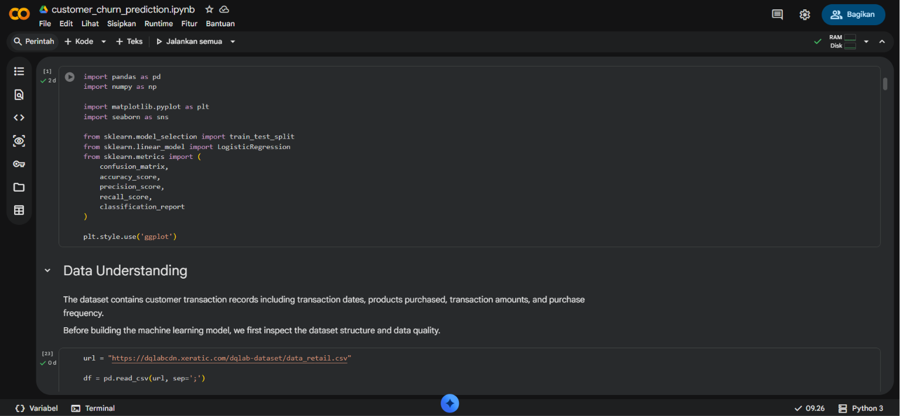

# 🛒 Retail Customer Churn Analysis & Prediction

A machine learning project that analyzes retail customer behavior and predicts customer churn using Logistic Regression. The project includes data preprocessing, exploratory data analysis (EDA), feature engineering, model evaluation, and business recommendations.

---

## 📸 Notebook Preview

---

## 🎯 Objectives

- Analyze customer transaction behavior.
- Identify churn patterns.
- Build a Logistic Regression model to predict customer churn.
- Evaluate model performance.
- Provide business recommendations to improve customer retention.

---

## 🛠 Tools & Technologies

- Python
- Pandas
- NumPy
- Matplotlib
- Seaborn
- Scikit-learn
- Google Colab

---

## 📂 Dataset

Retail Customer Transaction Dataset provided by DQLab for educational purposes.

---

## 🔍 Project Workflow

- Data Understanding
- Data Preparation
- Feature Engineering
- Exploratory Data Analysis (EDA)
- Logistic Regression Modeling
- Model Evaluation
- Business Recommendations

---

## 📊 Key Visualizations

- Customer Acquisition by Year
- Transaction by Year
- Average Transaction Amount by Product
- Churn Proportion by Product
- Distribution of Transaction Count
- Distribution of Average Transaction Amount
- Confusion Matrix
- Feature Coefficients

---

## 📈 Model Evaluation

The model was evaluated using:

- Accuracy
- Precision
- Recall
- Classification Report
- Confusion Matrix

---

## 💡 Business Recommendations

- Develop personalized promotions for customers with declining transaction activity.
- Introduce loyalty programs to encourage repeat purchases.
- Focus retention efforts on customers with low transaction frequency.
- Monitor high-value customers through targeted engagement campaigns.

---

## 👩‍💻 Author

**Adila Zahira Hasyati**

- GitHub: https://github.com/adilazahiraa
